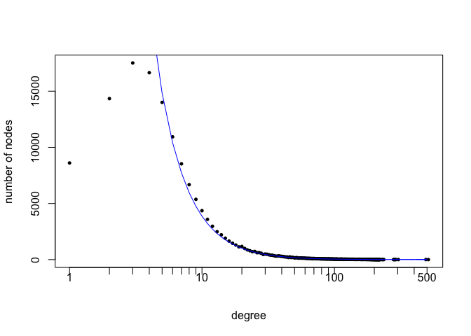

# Installation

**genet** can be installed via the `install_github` function in the
**devtools** package.

``` r
library(devtools)
install_github("aagrande/genet")
```

# Example: generating scale-free networks

Before invoking the generator via `genet`, we define:

- the number of communities `K` and node types `L`;
- a target community structure as encoded by the community assignments;
- a target degree distribution as encoded by a degree sequence with
  target degrees for each node type.

Depending on the application of interest, users can input their custom
community structure. Here, for simplicity, we will generate a balanced
structure via the `generate_balanced_assignments` function. This
function randomly assigns each node type to `K_each` communities such
that: no types have identical assignments; all communities have at least
one type; and the resulting graph of type-to-type interactions is
connected.

``` r
library(genet)
K <- 100
L <- 200
Z <- generate_balanced_assignments(K, L, K_each = 5)
```

For the target degree distribution, we choose a scale-free distribution:
\propto d^{-\alpha}"),
.
We choose the minimum and maximum degree, as well as the power law’s
exponent
,
so that the expected degree is approximately 15.

``` r
d_min <- 3
d_max <- 500
alpha <- 1.937
as.numeric(dpower_law(3:500, alpha, d_min, d_max) %*% 3:500)
```

    ## [1] 15.00011

To closely reproduce the power-law distribution, we set the target
degree sequence equal to the
")-quantiles
of the distribution. Also, we adjust the type cardinalities so that the
empirical distribution complies with the power law.

``` r
target_degrees <- qpower_law(seq(0, 1, length.out = L), alpha, d_min, d_max)
probs <- dpower_law(target_degrees, alpha, d_min, d_max)
ratios <- probs / min(probs)
cards <- round(ratios * 2)
```

We can now generate networks with the desired community structure and
target degree centrality distribution. We set `dc = TRUE` to specify
that we target the degree centrality (as opposed to the
eigencentrality).

``` r
g <- genet(n = 10, assignments = Z, cards = cards, multiedges = TRUE, dc = TRUE,
           target_centrality = target_degrees)
```

The output of `genet` is a list of `igraph` graph objects. The first
graph has the following number of nodes and edges:

``` r
cat("# of nodes = ", igraph::vcount(g[[1]]), "\n# of edges = ", igraph::ecount(g[[1]]), sep = "")
```

    ## # of nodes = 148611
    ## # of edges = 904523

Its empirical degree distribution is plotted below (the target power-law
is represented in blue).

<!-- -->

# References

- Grande and Feng, 2023. Principled and Scalable Network Generation with
  Built-in Community Structure and Target Centrality Measures.
